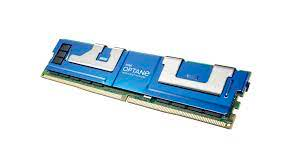
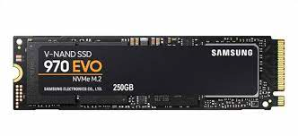
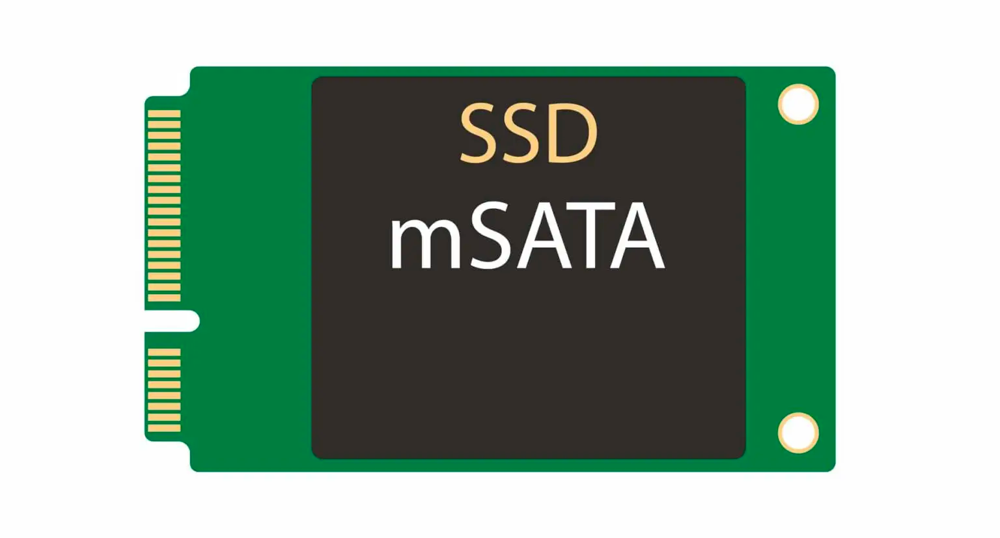
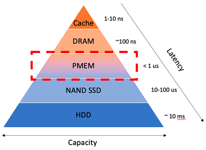
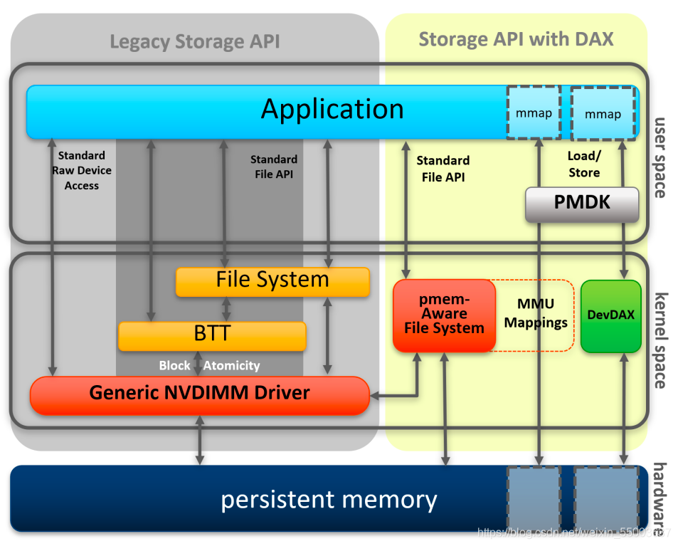
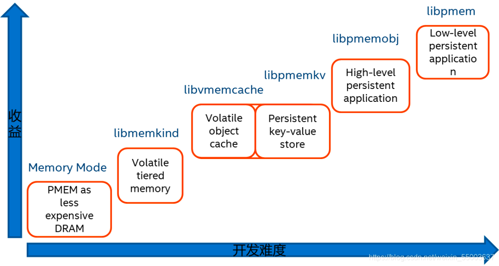

## Terminology
* PMem - Persistent memory (PMEM) is a solid-state high-performance byte-addressable memory device that resides on the memory bus. Being on the memory bus allows PMEM to have DRAM-like access to data, which means that it has nearly the same speed and latency of DRAM and the nonvolatility of NAND flash.

  (Intel® Optane™ Persistent Memory)
* NVM - Non-Volatile Memory
* SSD - Solid-state drives
  * NVME SSD - NVMe (nonvolatile memory express) is a new storage access and transport protocol for flash and next-generation solid-state drives (SSDs)
    
  * SATA SSD
  
* DRAM - Dynamic Random Access Memory (used a main memory - 1GB to 2GB in smartphones and tablets; 4GB to 16GB in laptops)
* SRAM - Static Random Access Memory (used L2 and L3 cache in a CPU - 1MB to 16MB)
  * SRAM and DRAM are the modes of integrated-circuit RAM where SRAM uses transistors and latches in construction while DRAM uses capacitors and transistors. These can be differentiated in many ways, such as SRAM is comparatively faster than DRAM; hence SRAM is used for cache memory while DRAM is used for main memory.
  * Because of the need to constantly refresh data, which takes time, DRAM is slower. The lack of a need to constantly refresh makes SRAM faster than DRAM; however, because SRAM needs more parts and wiring, an SRAM cell takes up more space on a chip than a DRAM cell does. Thus, SRAM is more expensive, not only because there is less memory per chip (less dense) but also because they are harder to manufacture.

## What's Pmem and what's the performance

Persistent memory (PMem) is a new storage technology that offers DRAM-like speed at SSD-like capacity.
official site: https://pmem.io/

Capacity & Latency differences between the major storage types:

## How to use PMem (Intel® Optane™ Persistent Memory)
Compatible usage methods:
* PMem device can be configured as storage interface with standard file access API supporting, which makes it similar to SSD.
* On the other hand, we can config it as general memory, which works exact the same as memory without persistence.

The benefit of this strategy is we can still use the existing application without changing, while the drawback is that they don't make the best use of PMem.
To make the best use of it, the `AppDirect` mode has been introduced. Under this mode, app can not only access it similar to memory but also persisting data.

## PMEM features
* Better performance than NAND(ssd), slower than DRAM
* PMEM has several times of life time than SSD, can be used for longer time, even longer than the server
* Lager capacity than DRAM, share the same channel as DRAM, no need to serialize/deserialize
* It's byte-addressable, no read-modify-write expense
* Can be accessed directly from CPU cache, through DMA(direct memory access) or RDMA(remote direct memory access)
* Data persistence
* After permission checking, user can access pmem data directly, without kernal interruption and page cache. 
* Persistent data can be used immediately without warmup loading.
* Pmem data won't take up DRAM space unless we load it to DRAM explicitly to further speed up the data access.

## PMem SNIA NVM program mode
The NVM program mode has been supported by both windows and Linux already.

## DRAM and PMEM price comparison
The 128 GB of DRAM costs $1,750 and the 128 GB of Optane PMEM costs $512, so that works out to 2.7X times better bang for the buck in raw memory performance on Sysbench for the Optane PMEM versus the DDR4 DRAM.

## PMDK libraries

## Resources:
  * In chinese: http://www.phpheidong.com/blog/article/97196/0b9fb8e0c6d8d66af7f3/
  * 英特尔®傲腾™持久内存介绍：
  https://www.intel.cn/content/www/cn/zh/products/memory-storage/optane-dc-persistent-memory.html
  * SNIA NVM 编程模型规范：
  https://www.snia.org/tech_activities/standards/curr_standards/npm
  * PMDK官方网站：
  https://pmem.io/
  * 书籍：持久内存编程中文版
  https://item.jd.com/13201774.html
  * PMDK:
  https://github.com/pmem/pmdk
  * libmemkind:
  http://memkind.github.io/memkind/
  * libvmemcache:
  https://github.com/pmem/vmemcache
  * pmemkv:
  https://github.com/pmem/pmemkv
  * libpmemobj-cpp:
  https://github.com/pmem/libpmemobj-cpp