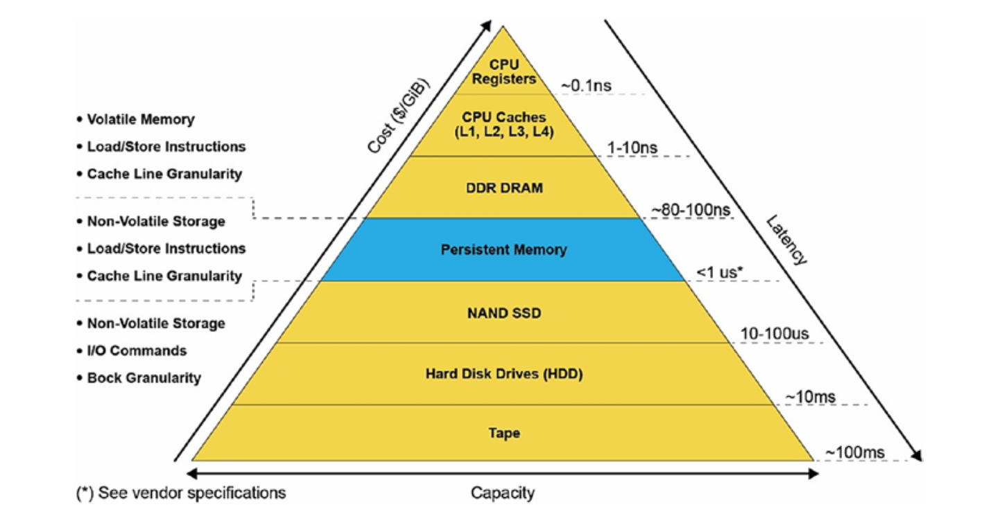
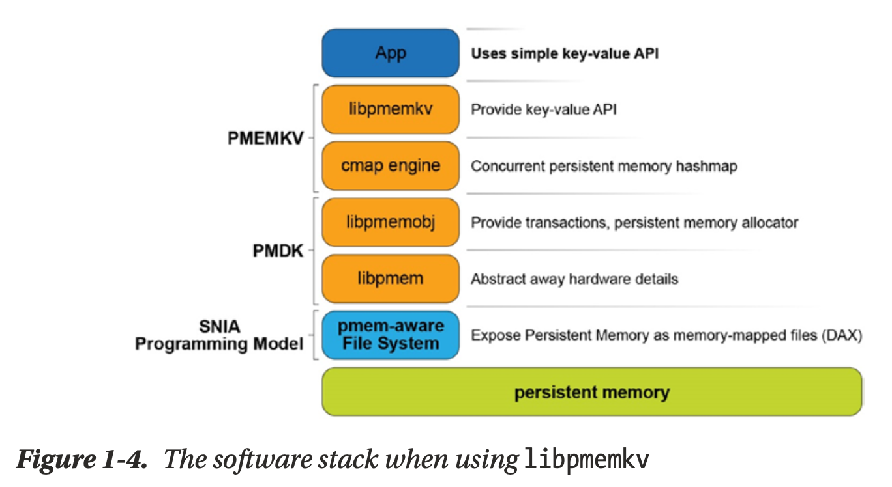

# Programming Persistent Memory

## Chapter 1 Introduction to Persistent Memory Programming

### What's different?
Taking the key-value for example:
Traditional storage:

Pmem

With the persistent memory key-value store, values are accessed by the application directly, without the need to first allocate buffers in memory. The kvprint() routine in Listing 1-1 will be called with references to the actual keys and values, directly where they live in persistence – something that is not possible with traditional storage.
### The performance Difference?

### Program Complexity
Perhaps the most important point of our example is that the programmer still uses
the familiar get/put interfaces normally associated with key-value stores. The fact that the data structures are in persistent memory is abstracted away by the high-level API provided by libpmemkv. This principle of using the highest level of abstraction possible, as long as it meets the application’s needs, will be a recurring theme throughout this book. We start by introducing very high-level APIs; later chapters delve into the lower- level details for programmers who need them. At the lowest level, programming directly to raw persistent memory requires detailed knowledge of things like hardware atomicity, cache flushing, and transactions. High-level libraries like libpmemkv abstract away all that complexity and provide much simpler, less error-prone interfaces.

### How does libpmemkv work?
All the complexity hidden by high-level libraries like libpmemkv are described more fully in later chapters, but let’s look at the building blocks used to construct a library like this.

Starting from the bottom of Figure 1-4 and working upward are these components:
* The persistent memory hardware, typically connected to the system memory bus and accessed using common memory load/store operations.
* A pmem-aware file system, which is a kernel module that exposes persistent memory to applications as files. Those files can be memory mapped to give applications direct access (abbreviated as DAX).
This method of exposing persistent memory was published by SNIA (Storage Networking Industry Association) and is described in detail in Chapter 3.
* The libpmem library is part of the PMDK. This library abstracts away some of the low-level hardware details like cache flushing instructions.
* The libpmemobj library is a full-featured transaction and allocation library for persistent memory. 
* The cmap engine, a concurrent hash map optimized for persistent memory. 
* The libpmemkv library, providing the API demonstrated in Listing 1-1.
* And finally, the application that uses the API provided by libpmemkv.

