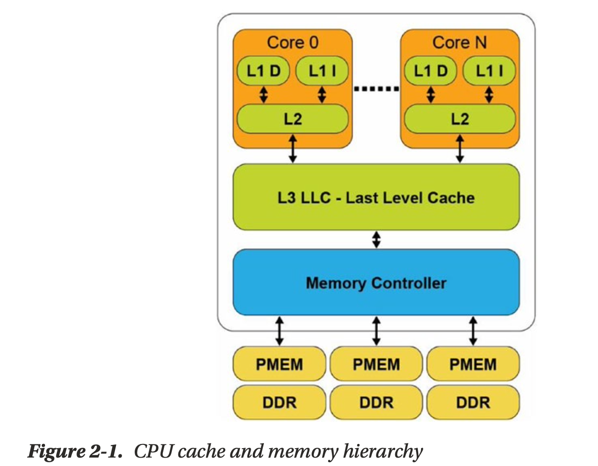
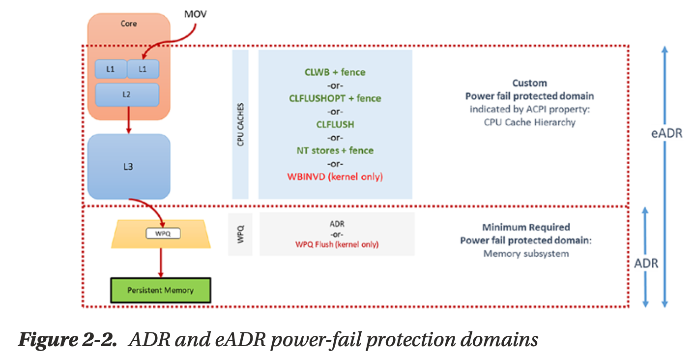
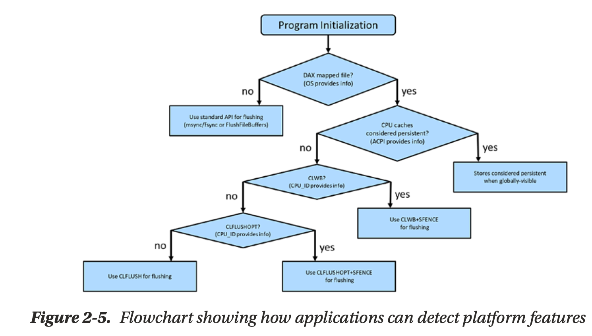
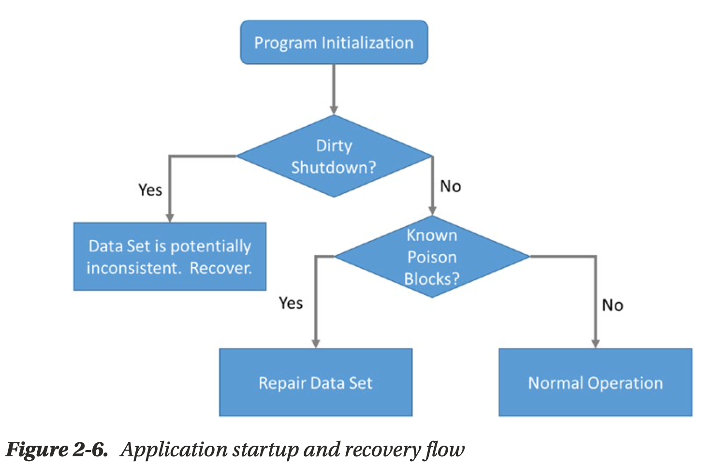

## Chapter 2 Persistent Memory Architecture
Applications that are designed to recognize the presence of persistent memory in a system can run much faster than using other storage devices because data does not have to transfer back and forth between the CPU and slower storage devices. Because applications that only use persistent memory may be slower than dynamic random- access memory (DRAM), they should decide what data resides in DRAM, persistent memory, and storage.
### Persistent memory characteristics
* Performance (throughput, latency, and bandwidth) of persistent memory is much better than NAND but potentially slower than DRAM.
* Persistent memory is durable unlike DRAM. Its endurance is usually orders of magnitude better than NAND and should exceed the lifetime of the server without wearing out.
* Persistent memory module capacities can be much larger than DRAM DIMMs and can coexist on the same memory channels.
* Persistent memory-enabled applications can update data in place without needing to serialize/deserialize the data.
* Persistent memory is byte addressable like memory. Applications can update only the data needed without any read-modify-write overhead.
* Data is CPU cache coherent.
* Persistent memory provides direct memory access (DMA) and remote DMA (RDMA) operations.
* Data written to persistent memory is not lost when power is removed.
* After permission checks are completed, data located on persistent memory is directly accessible from user space. No kernel code, file system page caches, or interrupts are in the data path.
* Data on persistent memory is instantly available, that is:
  * Data is available as soon as power is applied to the system.
  * Applications do not need to spend time warming up caches. They can access the data immediately upon memory mapping it.
  * Data residing on persistent memory has no DRAM footprint unless the application copies data to DRAM for faster access.
* Data written to persistent memory modules is local to the system. Applications are responsible for replicating data across systems.

### Platform support for persistent memory
Platform vendors such as Intel, AMD, ARM, and others will decide how persistent memory should be implemented at the lowest hardware levels. We try to provide a vendor-agnostic perspective and only occasionally call out platform-specific details.

### Cache hierarchy
]
* The L1 (Level 1) cache is the fastest memory in a computer system. In terms of access priority, the L1 cache has the data the CPU is most likely to need while completing a specific task. The L1 cache is also usually split two ways, into the instruction cache (L1 I) and the data cache (L1 D). The instruction cache deals with the information about the operation that the CPU has to perform, while the data cache holds the data on which the operation is to be performed.
* The L2 (Level 2) cache has a larger capacity than the L1 cache, but it is slower. L2 cache holds data that is likely to be accessed by the CPU next. In most modern CPUs, the L1 and L2 caches are present on the CPU cores themselves, with each core getting dedicated caches.
* The L3 (Level 3) cache is the largest cache memory, but it is also the slowest of the three. It is also a commonly shared resource among all the cores on the CPU and may be internally partitioned to allow each core to have dedicated L3 resources.
* Data read from DRAM or persistent memory is transferred through the memory controller into the L3 cache, then propagated into the L2 cache, and finally the L1 cache where the CPU core consumes it. When the processor is looking for data to carry out an operation, it first tries to find it into the L1 cache. If the CPU can find it, the condition is called a cache hit.

### Power-fail protected domains
System platform hardware supports the concept of a persistence domain, also called power-fail protected domains. Depending on the platform, a persistence domain may include the persistent memory controller and write queues, memory controller write queues, and CPU caches.
Once data has reached the persistence domain, it may be recoverable during a process that results from a system restart.

* Asynchronous DRAM Refresh (ADR) is a feature supported on Intel products which flushes the write-protected data buffers and places the DRAM in self-refresh. This process is critical during a power loss event or system crash to ensure the data is in a safe and consistent state on persistent memory. By default, ADR does not flush the processor caches. A platform that supports ADR only includes persistent memory and the memory controller’s write pending queues within the persistence domain.
* Enhanced Asynchronous DRAM Refresh (eADR) requires that a non-maskable interrupt (NMI) routine be called to flush the CPU caches before the ADR event can begin. Applications running on an eADR platform do not need to perform flush operations because the hardware should flush the data automatically, but they are still required
  to perform an SFENCE operation to maintain write order correctness. Stores should be considered persistent only when they are globally visible, which the SFENCE guarantees.

### The need for flushing, ordering and fencing
Except for WBINVD, which is a kernel-mode-only operation, the machine instructions in Table 2-1 (in the “Intel Machine Instructions for Persistent Memory” section)
are supported in user space by Intel and AMD CPUs. Intel adopted the SNIA NVM programming model for working with persistent memory. This model allows for
direct access (DAX) using byte-addressable operations (i.e., load/store). However, the persistence of the data in the cache is not guaranteed until it has entered the persistence domain.

### Data visibility
Applicable to Intel- and AMD-based ADR platforms, executing an Intel 64 and 32 architecture store instruction is not enough to make data persistent since the data may be sitting in the CPU caches indefinitely and could be lost by a power failure.

### Intel machine instructions for pmem
Server platform, CPU, and persistent memory features and capabilities are exposed to the operating system through the BIOS and ACPI that can be queried by applications. Applications should not assume they are running on hardware with all the optimizations available. Even if the physical hardware supports it, virtualization technologies may or may not expose those features to the guests, or your operating system may or may not implement them. As such, we encourage developers to use libraries, such as those in the PMDK, that perform the required feature checks or implement the checks within the application code base.

### Detecting platform capabilities
Server platform, CPU, and persistent memory features and capabilities are exposed to the operating system through the BIOS and ACPI that can be queried by applications. Applications should not assume they are running on hardware with all the optimizations available. Even if the physical hardware supports it, virtualization technologies may or may not expose those features to the guests, or your operating system may or may not implement them. As such, we encourage developers to use libraries, such as those in the PMDK, that perform the required feature checks or implement the checks within the application code base.

On Linux, direct access is achieved by mounting an XFS or ext4 file system with
the "-o dax" option. On Microsoft Windows, NTFS enables DAX when the volume
is created and formatted using the DAX option. If the file system is not DAX-enabled, applications should fall back to the legacy approach of using msync(), fsync(), or FlushFileBuffers().

If the file system is DAX-enabled, the next check is to determine whether the platform supports ADR or eADR by verifying whether or not the CPU caches are considered persistent. On an eADR platform where CPU caches are considered persistent, no further action is required. Any data written will be considered persistent, and thus there is no requirement to perform any flushes, which is a significant performance optimization. On an ADR platform, the next sequence of events identifies the most optimal flush operation based on Intel machine instructions previously described.

### Application startup and recovery
In addition to detecting platform features, applications should verify whether the platform was previously stopped and restarted gracefully or ungracefully. Figure 2-6 shows the checks performed by the Persistent Memory Development Kit.

Some persistent memory devices, such as Intel Optane DC persistent memory, provide SMART counters that can be queried to check the health and status. Several libraries such as libpmemobj query the BIOS, ACPI, OS, and persistent memory module information then perform the necessary validation steps to decide which flush operation is most optimal to use.

