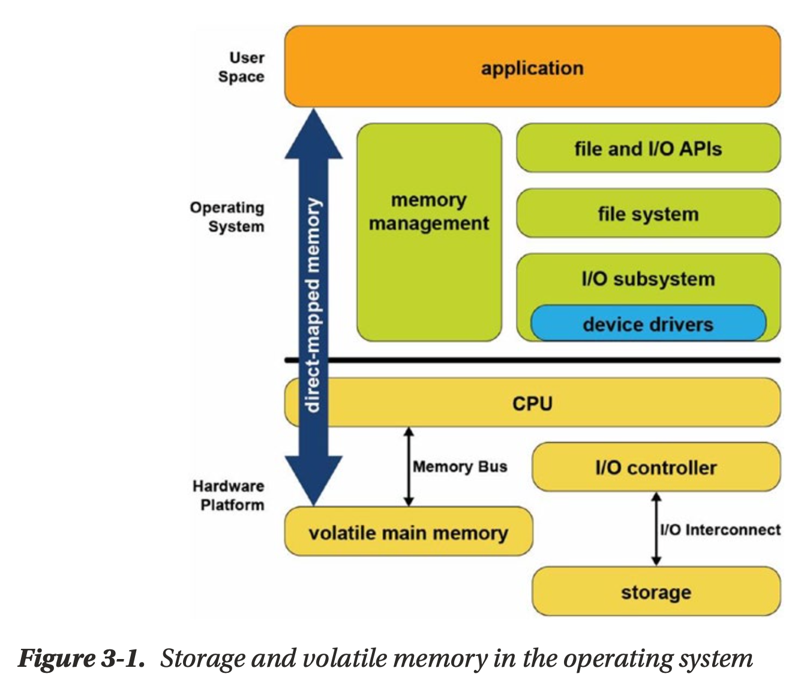
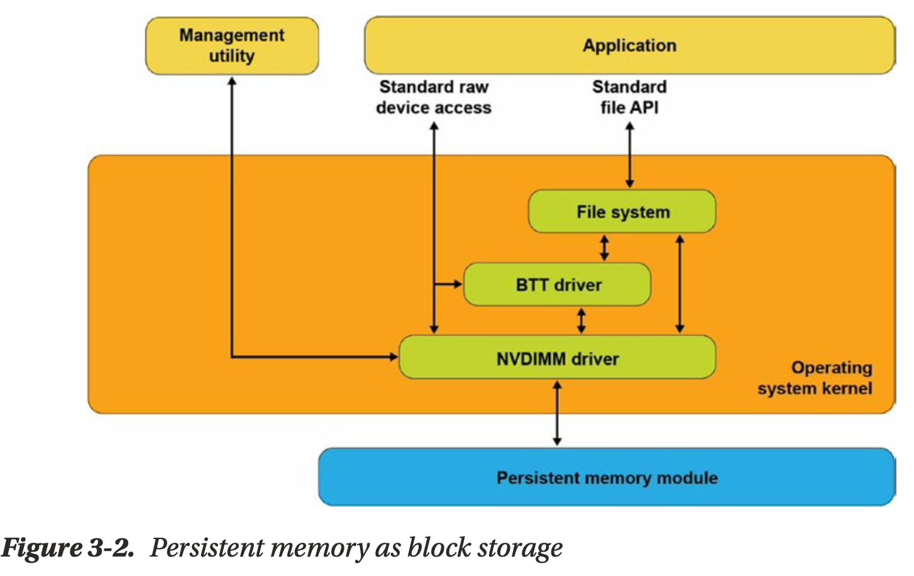
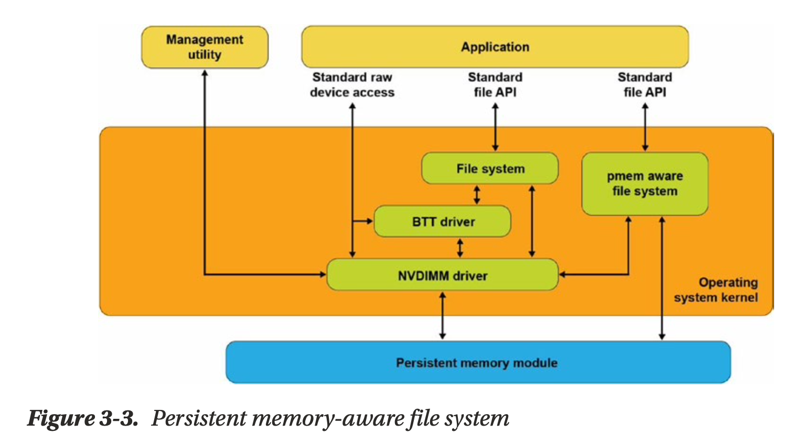
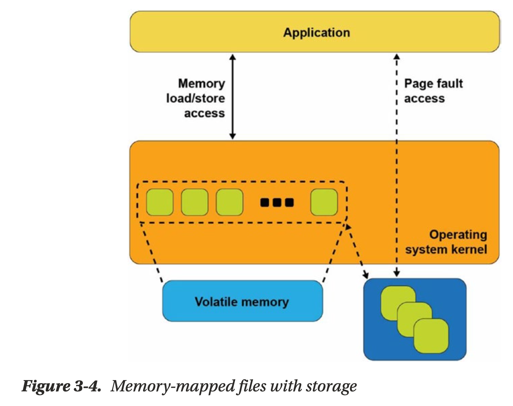
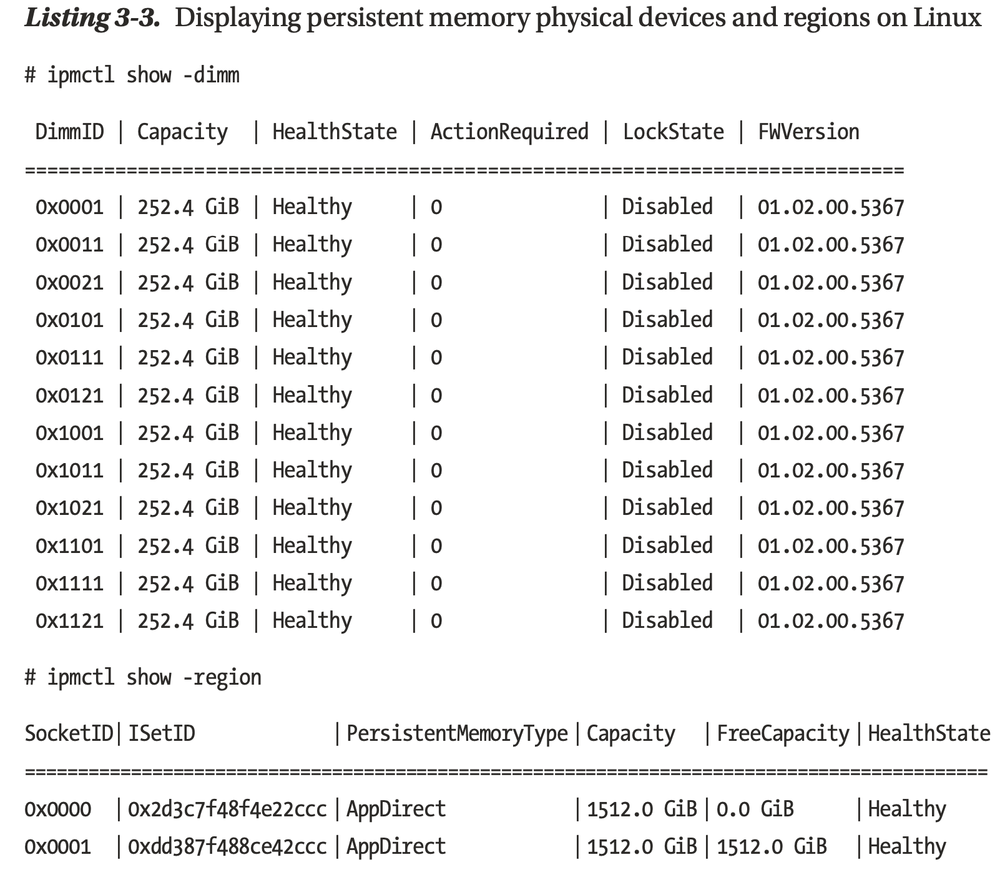
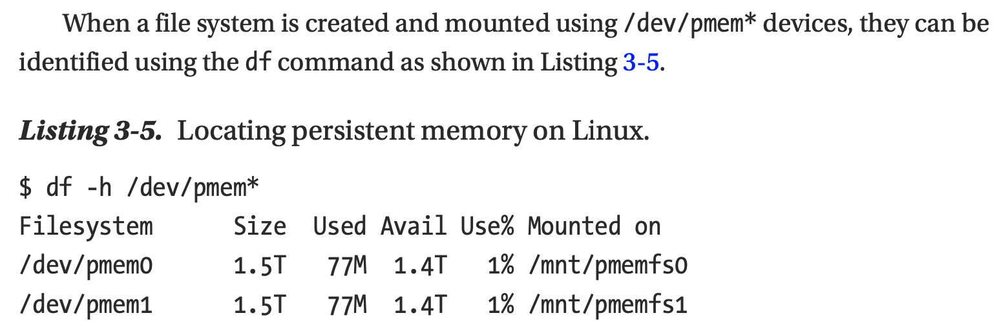
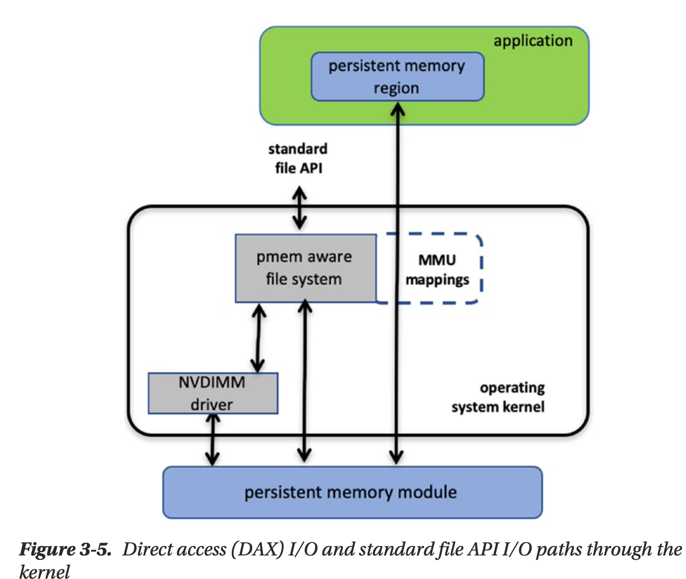
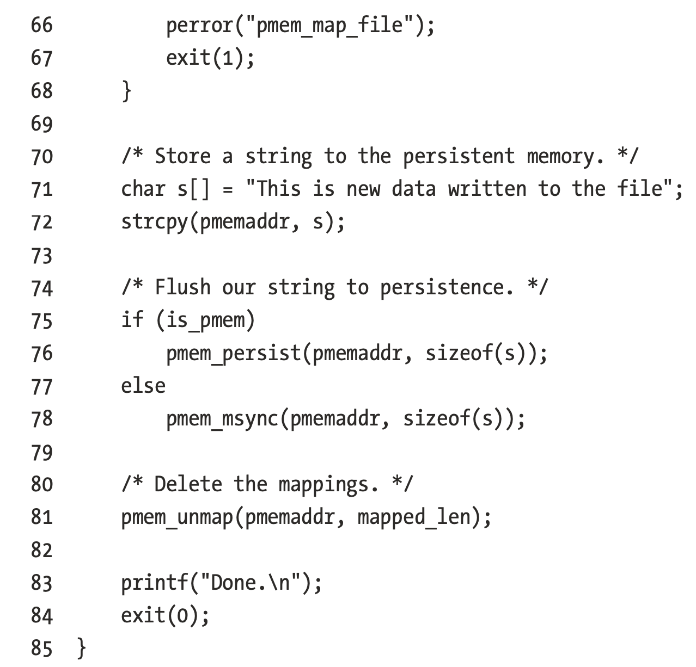
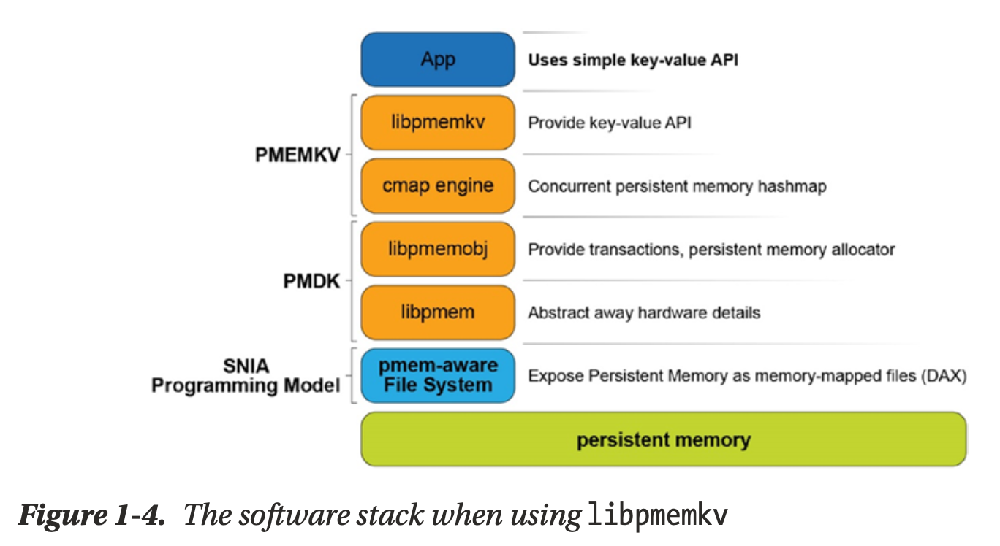
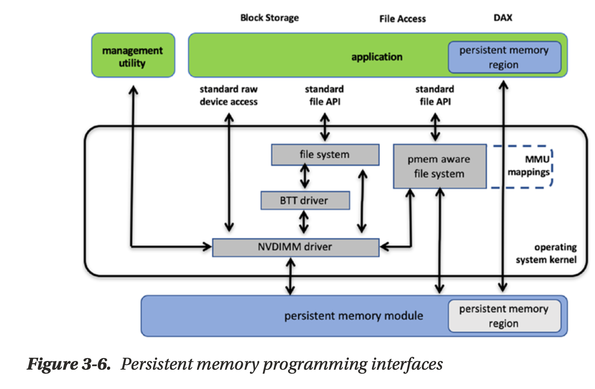

## Chapter 3 Operating System Support for Persistent Memory

### Operating System Support for Memory and Storage

Figure 3-1 shows a simplified view of how operating systems manage storage and volatile memory. As shown, the volatile main memory is attached directly to the CPU through a memory bus. The operating system manages the mapping of memory regions directly into the application’s visible memory address space. Storage, which usually operates at speeds much slower than the CPU, is attached through an I/O controller. The operating system handles access to the storage through device driver modules loaded into the operating system’s I/O subsystem.

### Persistent Memory As Block Storage
The first operating system extension for persistent memory is the ability to detect the existence of persistent memory modules and load a device driver into the operating system’s I/O subsystem as shown in Figure 3-2. This NVDIMM driver serves two important functions. 

The NVDIMM driver presents persistent memory to applications and operating system modules as a fast block storage device. This means applications, file systems, volume managers, and other storage middleware layers can use persistent memory the same way they use storage today, without modifications.

Figure 3-2 also shows the Block Translation Table (BTT) driver, which can be optionally configured into the I/O subsystem. 

### Persistent Memory-Aware File Systems
These persistent memory-aware file systems continue to present the familiar, standard file APIs to applications including the open, close, read, and write system calls. This allows applications to continue using the familiar file APIs while benefiting from the higher performance of persistent memory.

### Memory-Mapped Files

Before describing the next operating system option for using persistent memory, this section reviews memory-mapped files in Linux and Windows. When memory mapping a file, the operating system adds a range to the application’s virtual address space which corresponds to a range of the file, paging file data into physical memory as required. This allows an application to access and modify file data as byte-addressable in-memory data structures. This has the potential to improve performance and simplify application development, especially for applications that make frequent, small updates to file data.

Applications memory map a file by first opening the file, then passing the resulting file handle as a parameter to the mmap() system call in Linux or to MapViewOfFile() in Windows. 

### Persistent Memory Direct Access (DAX)

The persistent memory direct access feature in operating systems, referred to as DAX in Linux and Windows, uses the memory-mapped file interfaces described in the previous section but takes advantage of persistent memory’s native ability to both store data
and to be used as memory. Persistent memory can be natively mapped as application memory, eliminating the need for the operating system to cache files in volatile main memory.

To use DAX, the system administrator creates a file system on the persistent memory module and mounts that file system into the operating system’s file system tree. For Linux users, persistent memory devices will appear as /dev/pmem* device special files. To show the persistent memory physical devices, system administrators can use the ndctl and ipmctl utilities shown in Listings 3-3 and 3-4.

Managing persistent memory as files has several benefits:
* You can leverage the rich features of leading file systems for organizing, managing, naming, and limiting access for user’s persistent memory files and directories.
* You can apply the familiar file system permissions and access rights management for protecting data stored in persistent memory and for sharing persistent memory between multiple users.
* System administrators can use existing backup tools that rely on file system revision-history tracking.
* You can build on existing memory mapping APIs as described earlier and applications that currently use memory-mapped files and can use direct persistent memory without modifications.

Once a file backed by persistent memory is created and opened, an application still calls mmap() or MapViewOfFile() to get a pointer to the persistent media. The difference, shown in Figure 3-5, is that the persistent memory-aware file system recognizes that
the file is on persistent memory and programs the memory management unit (MMU)
in the CPU to map the persistent memory directly into the application’s address space. Neither a copy in kernel memory nor synchronizing to storage through I/O operations
is required. The application can use the pointer returned by mmap() or MapViewOfFile() to operate on its data in place directly in the persistent memory. 

Since no kernel I/Ooperations are required, and because the full file is mapped into the application’s memory, it can manipulate large collections of data objects with higher and more consistent performance as compared to files on I/O-accessed storage.

C example

