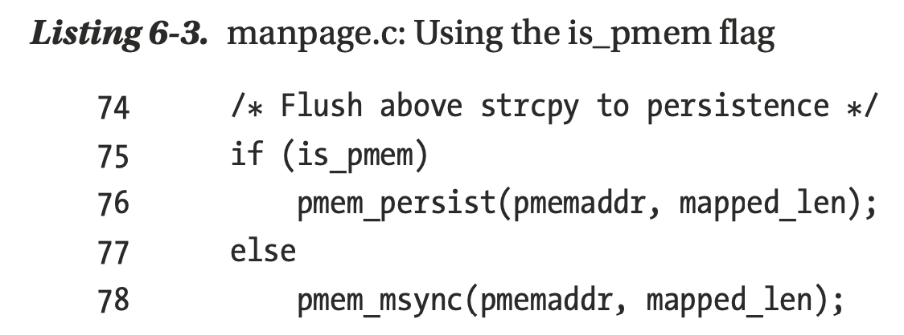
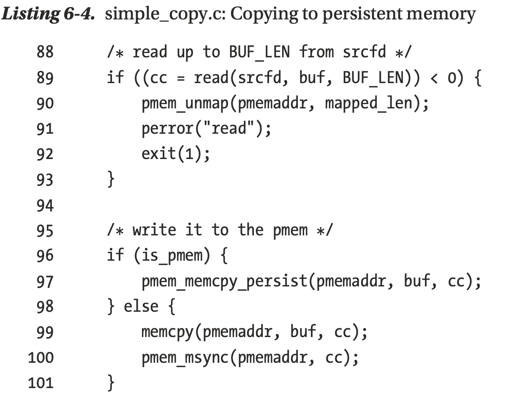

This C library is very low level, dealing with things like CPU instructions related to persistent memory, 
optimal ways to copy data to persistence, and file mapping.

Programmers who only want completely raw access to persistent memory, without libraries to provide allocators or transactions, will likely want to use libpmem as a basis for their development.


For most programmers, libpmem is too low level, and you can safely skim this chapter quickly (or skip it altogether) and move on to the higher-level, friendlier libraries available in PMDK. 
All the PMDK libraries that deal with persistence, such as libpmemobj, are built on top of libpmem to meet their low-level needs.


## Mapping a File

The libpmem library contains some convenience functions for memory mapping files. Of course, your application can call mmap() on Linux or MapViewOfFile() on Windows directly, but using libpmem has some advantages:
* libpmem knows the correct arguments to the operating system mapping calls. For example, on Linux, it is not safe to flush changes to persistent memory using the CPU instructions directly unless the mapping is created with the MAP_SYNC flag to mmap().
* libpmem detects if the mapping is actually persistent memory and if using the CPU instructions directly for flushing is safe.

* Mapping a persistent memory file
```c
/* Create a pmem file and memory map */
if ((pmemaddr = pmem_map_file(argv[2], BUF_LEN, PMEM_FILE_CREATE|PMEM_FILE_EXCL,0666, &mapped_len, &is_pmem)) == NULL) {
  perror("pmem_map_file");
  exit(1);
}
```
As part of the persistent memory detection mentioned earlier, the flag is_pmem is returned by pmem_map_file. It is the caller’s responsibility to use this flag to determine how to flush changes to persistence. When making a range of memory persistent, 
the caller can use the optimal flush provided by libpmem, pmem_persist, only if the is_pmem flag is set.


## Copy to Persist memory
There are several interfaces in libpmem for optimally copying or zeroing ranges of persistent memory. The simplest interface shown in Listing 6-4 is used to copy the block of data from the source file to the persistent memory in the destination file and flush it to persistence.


Notice how the is_pmem flag on line 96 is used just like it would be for calls to pmem_ persist(), since the pmem_memcpy_persist() function includes the flush to persistence.
The interface pmem_memcpy_persist() includes the flush to persistent because it may determine that the copy is more optimally performed by using non-temporal stores, which bypass the CPU cache and do not require subsequent cache flush instructions for persistence. By providing this API, which both copies and flushes, libpmem is free to use the most optimal way to perform both steps.


## Separating the Flush Steps
Flushing to persistence involves two steps:
1. Flush the CPU caches or bypass them entirely as explained in the previous example.
2. Wait for any hardware buffers to drain, to ensure writes have reached the media.

These steps are performed together when pmem_persist() is called, or they can be called individually by calling pmem_flush() for the first step and pmem_drain() for the second. Note that either of these steps may be unnecessary on a given platform, and the library knows how to check for that and do what is correct. 

