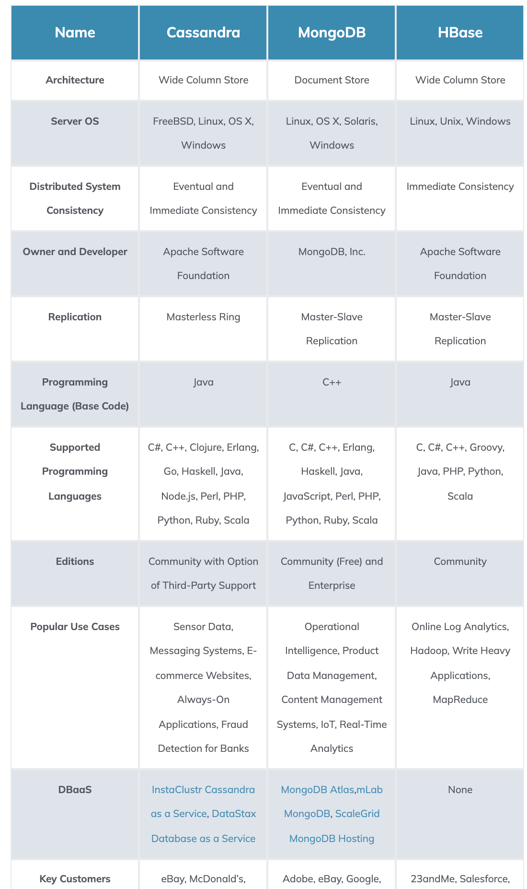
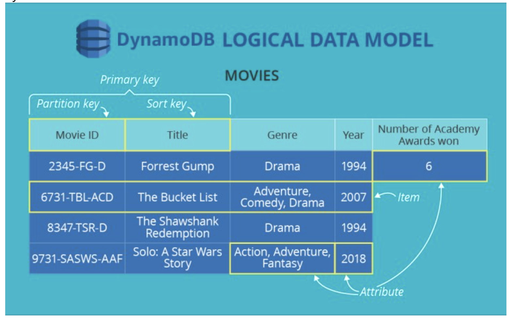
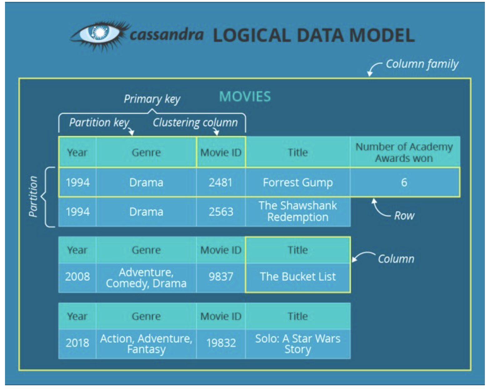
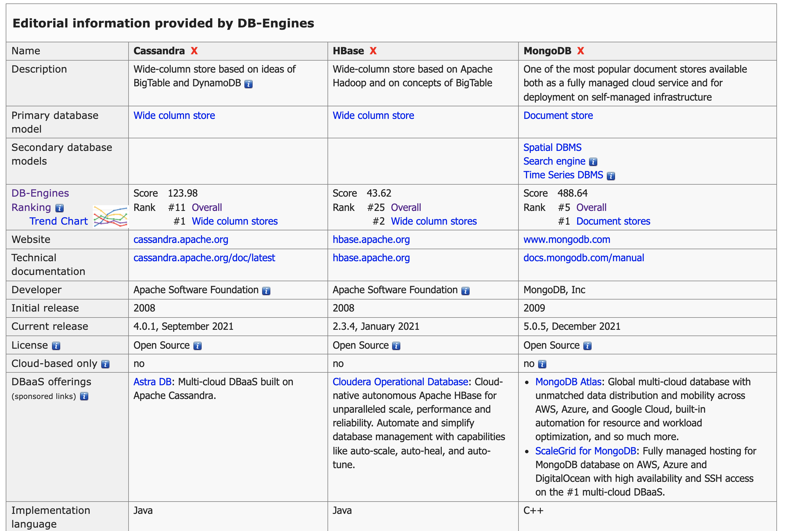
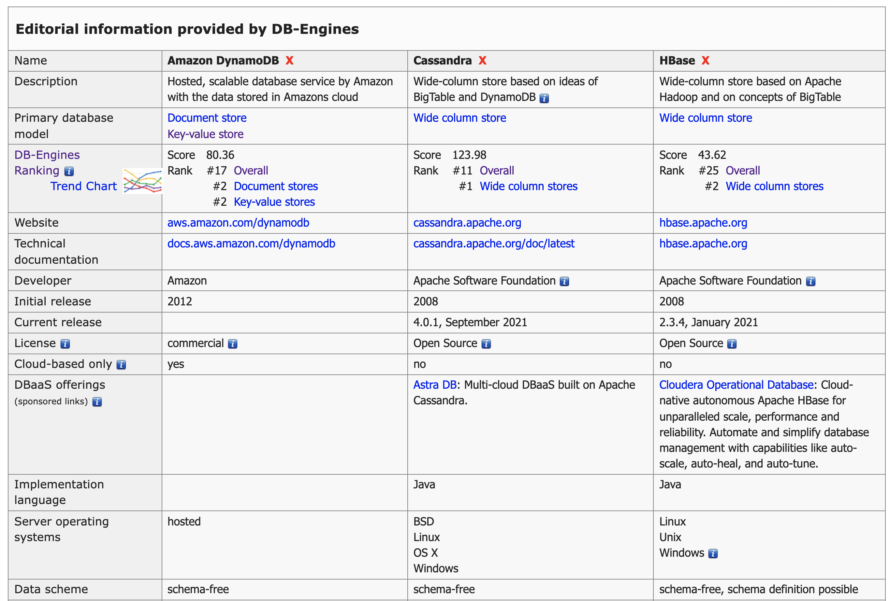

DB-Engines Real-time Ranking
https://db-engines.com/en/ranking

HBase
* Wide-column store based on Apache Hadoop and on concepts of BigTable
* HBase is an open-source non-relational distributed database modeled after Google's Bigtable and written in Java. It is developed as part of Apache Software Foundation's Apache Hadoop project and runs on top of HDFS or Alluxio, providing Bigtable-like capabilities for Hadoop.

MongoDB
* MongoDB is the most popular document store on the market and is also one of the leading Database Management Systems. It was created in 2007 by the team behind DoubleClick (currently owned by Google) to address the scalability and agility issues in serving Internet ads by DoubleClick.

Cassandra
* Open sourced by Facebook
* Cassandra is the most popular wide column store database system on the market. Initially developed at Facebook for Facebook’s Inbox search feature, Cassandra was open-sourced in 2008 and subsequently made a top-level project for Apache on February 17, 2010.
* Unlike MongoDB, Cassandra uses a masterless “ring” architecture which provides several benefits over legacy architectures like master-slave architecture. This, in turn, means that all nodes in a cluster are treated equally, and a majority of nodes can be used to achieve quorum.
* Cassandra stores data in columns and rows like a traditional RDBMS, it provides agility in the sense that it allows rows to have different columns, and even allows a change in the format of the columns. Apart from this, its query language, Cassandra Query Language (CQL), closely resembles the traditional SQL syntax, and thus, can be easier for SQL users to understand. This gives it some leverage in any comparison of Cassandra vs. HBase.
* Some of Cassandra’s most common use cases include messaging systems (for its superior read and write performance), real-time sensor data, and e-commerce websites.
* Cassandra is currently maintained by the Apache Software Foundation. Third-party companies like DataStax, URimagination, and Impetus provide support based on their database implementations. Cassandra boasts several large organizations among its users, including GitHub, Facebook, Instagram, Netflix, and Reddit.
]

DynamoDB VS Cassandra

Details: https://www.kdnuggets.com/2018/08/dynamodb-vs-cassandra.html

Here’s a simple DynamoDB table. Its rows are items, and cells are attributes. In DynamoDB, it’s possible to define a schema for each item, rather than for the whole table.
Each table has a primary key, which can be either simple or composite. If the primary key is simple, it contains only a partition key that defines what partition will physically store the data. And if the primary key is composite, it consists of both a partition key and a sort key. In this case, a partition key performs the same function and the sort key, as seen in its very name, sorts the data with the same partition key.

Here’s a simple Cassandra column family (also called a table).It consists of rows that contain varying numbers of columns.

Every column family has a primary key. It may be simple or compound. If the primary key is simple, it contains only a partition key that determines what node and what partition are going to store the data. If the primary key is compound, it includes both a partition key and clustering columns. The former is used for the same purposes as in a simple primary key, while the latter sorts data within one partition.

Other differences:
* Amazon DynamoDB is a key-value and document-oriented store, while Apache Cassandra is a column-oriented data store.
* Although DynamoDB can store numerous data types, Cassandra’s list of supported data types is more extensive: it includes, for instance, tuples, varints, timeuuids, etc.
* In DynamoDB, partition keys and sort keys can contain only one attribute. While Cassandra allows including more than one column(attribute) into partition keys and clustering columns.
* DynamoDB’s ‘partition’ ≠Cassandra’s ‘partition.’ In DynamoDB, it’s a physical part of storage allocated for a particular chunk of a table(each partition can ‘weigh’ up to 10 GB). And Cassandra’s partition is a set of rows in a column family that has the same partition key and is therefore stored on one node.

Cassandra vs Hbase vs MongoDB

DynamoDB vs Cassandra vs HBase

TiDB
* TiDB is an open-source NewSQL database that supports Hybrid Transactional and Analytical Processing workloads. It is MySQL compatible and can provide horizontal scalability, strong consistency, and high availability. It is developed and supported primarily by PingCAP, Inc. and licensed under Apache 2.0.

TiKV
* tikv - Distributed transactional key-value database, originally created to complement TiDB

