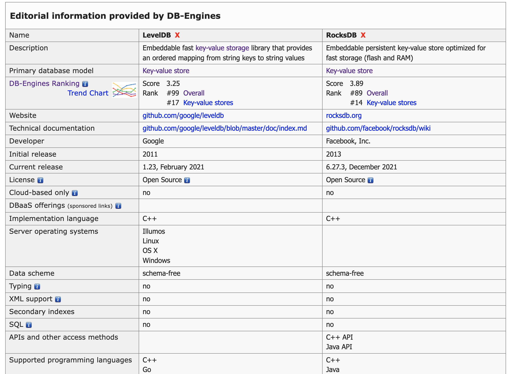

Storage engine:

LevelDB
* Open sourced by Google at 2011
* Embeddable fast key-value storage library that provides an ordered mapping from string keys to string values
* embedded key-value store inspired by the low-level storage engine used by BigTable

RocksDB
* Open sourced by Facebook at 2013
* RocksDB is a fork of an earlier Google project called LevelDB, which was an embedded key-value store inspired by the low-level storage engine used by BigTable
* Embeddable persistent key-value store optimized for fast storage (flash and RAM)
* log-structured merge trees (LSMs) - RocksDB implements what is known in the database literature as a log-structured merge tree aka LSM tree. Going into the details of LSM trees, and RocksDB’s implementation of the same, is out of the scope of this blog, but suffice it to say that it’s an indexing structure optimized to handle high-volume—sequential or random—write workloads.
* RocksDB，它是一个高性能的Key-Value数据库。所有记录在业务上是有序的，对key的查询其实会执行类似二分查找。持久化是通过写入有序文件来实现的。高性能的写入是通过先写入内存结构来保证的（写满的内存结构刷到持久化文件）。提供了level机制对数据做分层，优先查询最新写入的level从而提升查询性能。针对查询有常见的缓存、索引机制，也有压缩、编码机制来节省存储空间。
* Usages
  *  Apache Cassandra
  *  CockroachDB
  *  MySQL (MyRocks)
  *  Rockset
  *  Kafka Streams
  *  Apache Samza

LevelDB vs RocksDB

BerkeleyDB
* Oracle acquired sleepycat, the creating of BDB
* The first implementation of the Bitcoin cryptocurrency retains use of 2009 Berkeley DB 4.8 for one feature

WireTiger
* Acquired by MongoDB, it's the new storage supported by MongoDB
* Built by same architect of BerkeleyDB
* WiredTiger implemented both LSM tree and copy on write b-tree, mongodb used b-tree
* WiredTiger ，Cache采用Btree方式组织，每个Btree节点为一个page，数据以page为单位按需从磁盘加载或写入磁盘。wiredTiger写操作先到cache，并持久化WAL。每60s或log文件达到2G，则执行一次Checkpoint持久化，产生一个新快照。wiredTiger连接初始化时，先将数据恢复到最新的快照，再根据WAL恢复数据。持久化时，写入新的page(不会写原理的leaf page)。执行Chechpoint之后，产生新的page。

Redis & Memcached
* Store data in memory for fast retrieval, making them perfect targets for caching.
* Are a NoSQL data store, keeping data as key value pairs.
* Are both open source, with plenty of documentation to help get set up.
* Redis stores data as specific data types, whereas Memcached only stores data as strings. Because of this, Redis can change data in place without having to re-upload the entire data value. This reduces network overhead. 

Sled
* Sled is an embedded key-value store written in Rust. It provides atomic single-key operations, including compare and swap operation. It is designed to be used as a construction component to build larger stateful systems. Sled is optimized for modern hardware. It uses lock-free data structures to improve scalability and organizes storage on disk in a log-structured way optimized for SSDs.
* It's beta version still, shouldn't use in prod
* RocksDB is still the best option so far.
